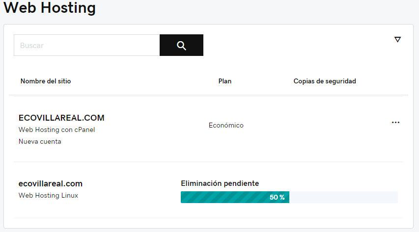
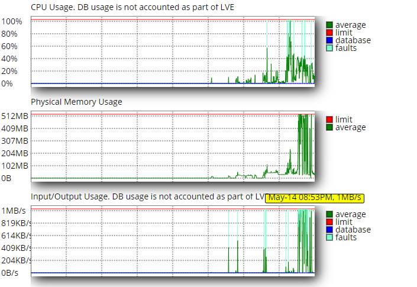
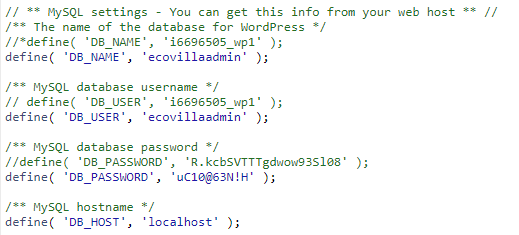
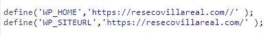
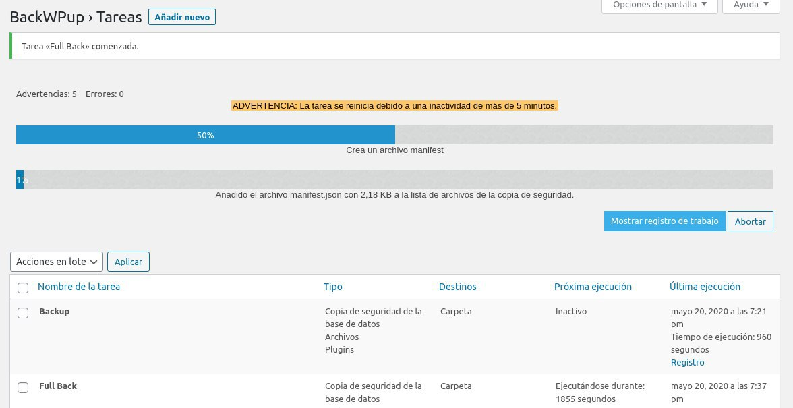

# Desarrollo de la Pagina de Eco Villa Real

El siguiente documento contiene eventos y el proceso de desarrollo de la pagina para el Residencial Eco Villa Real.

## Mantenimiento Inicial del Sitio
1. Se elimino el plugin llamado Jetpack, el cual no permitía que wp funcionara.
2. Se realizo un backup del sitio, este esta ubicado en una carpeta de GDrive.
3. Se actualizo a la versión mas reciente de wordpress (5.4.1).
4. Se actualizaron todos los plugins existentes.

## Personalización, Desarrollo y Plugins Utilizados
1. Se instalo el tema de Astra.
2. Se instalo el plugin Astra-Starter Templates.
3. Se importo el template "outdoor" adventure.
4. Se migro la información de "Acerca de Nosotros" y "Ubicación" a una 
   única pagina llamada "Sobre Nosotros".
5. Se unieron todas las fotos rescatadas del sitio previo bajo un sitio llamado "Galería".
6. Se creo una pagina de "Asamblea" para los blogs de las pagina.
7. Se creo un “Landing Page” para el sitio.
8. Se migro la información de http://www.podioconsultores.com/reservasvr/ hacia la pagina de reservaciones.
9. Se creo el modulo de booking.
10. Se modificaron los correos para mostrar las áreas reservadas.
11. Se elimino la opción de reservar el mismo día.
12. Se actualizo el panel de administración para mostrar una vista semanal y diaria de las reservaciones.
13. Se configuro la funcionalidad para la aprobación o negación remota de las reservaciones, esto enruta hacia una pagina especial donde se confirma la acción tomada. Esto es realizado mediante el correo enviado a la administración una vez se crea una nueva aprobación.
## Recuperación del Sitio
Aproximadamente a las 12 am uno de los integrantes del equipo de desarrollo encontró la pagina caída, tras inspección del suceso se encontró que la base de datos bajo la cual el wordpress fue instalado había sido borrada. Entre las posibles causas se descarto un ataque de inyección de SQL y se sospecha que un usuario malicioso con credenciales al panel de Godaddy llego a borrarla. Aun así se contaba con un backup completo del sitio y este fue restaurado en aproximadamente 10 minutos.
### Reparación del Hosting
Poco después de terminar el desarrollo del sitio, el modulo de reservaciones paro de funcionar o más bien este se quedaba cargando sin llegar a completar entre otros síntomas se volvió imposible modificar el sitio e instalar, actualizar y remover plugins en el sitio de wordpress. El único código de error o indicio que proporcionaba el sitio era un 503, se probaron múltiples soluciones entre las cuales se intento:
1. Remover todos los plugins a excepción del plugin de preservación para averiguar si existía algún conflicto.
2. Desactivar las notificaciones por correo del plugin en caso de que el servidor de correo estuviera bloqueando dichas transacciones.
3. Según GoDaddy, una posible solución seria desactivar firewall del sitio pero para tener acceso a esto fue necesario adquirir una licencia especial de seguridad. (No soluciono el problema)
4. Según GoDaddy, una posible solución seria tanto actualizar el plan de hosting a uno mas reciente con cPannel lo cual de nuevo requiere de costo adicional.
### Actualizacion del Hosting
Tras conversar con un agente de soporte de GoDaddy, se llego al acuerdo de mejorar el hosting antiguo a uno actualizado con acceso a cPannel. A pesar del costo de entrada para un mes, se utilizara el saldo restante del plan previo lo cual incremento el plan por 6 meses en total. A este tipo de problemas se les conoce como una deuda tecnológica (Technical debt) donde se les esta dando soporte a un servicio, tecnología o en este caso un servidor desactualizado, antiguo o deprecado donde este impide la evolución del producto de software tanto para el cliente como para el desarrollador.

### El nuevo dominio y plan de Hospedaje

Debido a la alta espera de **GoDaddy** **se opto** por adquirir por un nuevo dominio *llamado* **resecovillareal.com** en el cual es realizaria la misma configuración que el sitio original, aunque esto requiere de pasar varios "**features"** adquiridos para el dominio original se cree que es la mejor solución. Con el nuevo **cPannel** se tiene un mejor control sobre el sitio, lo cual ayudara en la depuración del sitio especialmente sobre el uso de recursos del sitio.

Con respecto a la configuración del sitio, se esta siguiendo el sitio original como base para la elaboración de este. Este fue un proceso sencillo puesto que mediante la recuperación de la base de datos toda la configuración previa es trasladada al nuevo sitio, entre los errores que se tuvieron que resolver fueron los siguientes:

- Configurar el wordpress a utilizar la nueva base de datos configurando el archivo `wp-config.php` para apuntar hacia la nueva base de datos.
  
-  En el momento de acceder a la pagina esta se encontraba redireccionando al usuario al dominio original osea ecovillareal.com, esto se arreglo mediante las siguientes lineas de código.
  

## Bajos Recursos

El nuevo servidor parece contar con ciertas especificaciones técnicas bajas, especialmente la memoria física o RAM donde esta llega al máximo de su capacidad con actividades consideradas de baja intensidad para el sistema un claro ejemplo de esto se dio durante la personalización del sitio cuando se estaba subiendo un icono del residencial para que sea usado en la barra de navegación. Acá los recursos de entrada y salida (lectura y escritura en el disco duro del servidor) y la memoria física del servidor llegaron al máximo de su capacidad. 

Este impidió hacer una actividad critica la cual radica en los respaldos del sitio completo, que a pesar de ellos se soluciono utilizando la herramienta de respaldo proporcionada por GoDaddy

